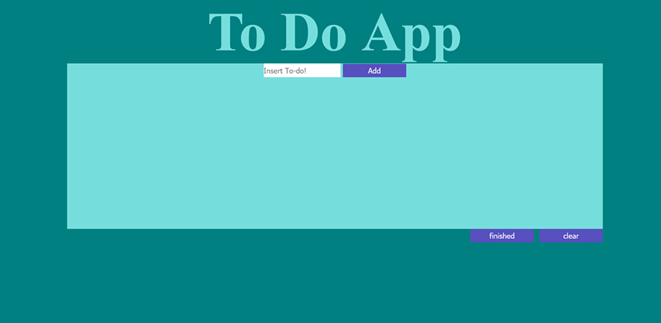

# Vanilla JS To-Do-App
<h2>Simple To-Do-App made with JS,HTML,CSS</h2>

To try click <a href="https://rivveneyes.github.io/To-Do-App/">HERE</a>

<h3>SUMMARY</h3>

This app took me about 3 days to build. Along the way I picked up alot of information about event-handling and event bubblinp.
I added a few features to this app other than just adding a to-do you can remove,edit,check-Done and delete then.

<h3>AUTHOR</h3>
Joshua Garcia- full-stack Developer <a href="https://rivveneyes.github.io/">Website</a> |
 

